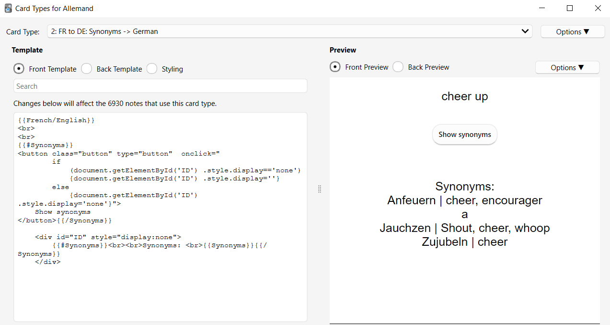

- [AnkiHint](#ankihint)
  - [Background](#background)
    - [Hint generation](#hint-generation)
      - [For language learning](#for-language-learning)
      - [Generating a chronological list](#generating-a-chronological-list)
    - [Cloze to Basic conversion](#cloze-to-basic-conversion)
  - [How to use the scripts](#how-to-use-the-scripts)
    - [Using a WSL environment](#using-a-wsl-environment)
    - [Examples of scripts to automate editing notes](#examples-of-scripts-to-automate-editing-notes)
      - [Convert cloze notes on the same theme](#convert-cloze-notes-on-the-same-theme)
      - [Generate hints](#generate-hints)
  - [Roadmap](#roadmap)
  - [Contributing](#contributing)

# AnkiHint

AnkiHint is a set of Python scripts to convert Anki flashcards from Cloze to Basic types and generate hints easily using information from several related cards.

## Background

### Hint generation

I use Anki flashcards daily to learn stuff on different topics (learning Chinese, some general knowledge, etc).
Even if it is better to create your own notes, I started my learning path by using existing decks to have a starting point,
but those were not always adapted to my way of learning.
I realized I often needed to get information from other notes as hints to help me find the answer to a card.

#### For language learning

In any language, there are often many synonyms or similar looking words.
As a hint to a card, I would list the synonyms of a word to help me know which word I am looking for.

> Ex: For my German deck, the notes have the following fields: `German`, `French/English`, `Synonyms`, `Example sentences`.
> My `French/English -> German` card looks like that:

> Each line represent a synonym from the information from another German note.
> The hint follows the template : `<german> | <english>`.
> And for the current note where I have to find the german word `aufmuntern` for `cheer up`, I replace the hint with the first letter of the word.


#### Generating a chronological list

Another example is with the list of Winners of the Tour de France that was in a General Knowledge deck that I had imported.

For the card for 1976 where Lucien Van Impe won the competition, the hint I generated is like

> - 1960 |Gastone Nencini |
> - 1965 |Felice Gimondi |
> - 1966 |Lucien Aimar |
> - 1967 |Roger Pingeon |
> - 1968 |Jan Janssen |
> -
> - 1973 |Luis Ocaña |
> - ?
> -
> - 1980 |Joop Zoetemelk |
> - 1987 |Stephen Roche |
> - 1988 |Pedro Delgado |

I did the same with the list of books written by the same author, or the albums of the same group.

**The main need for the project was to generate these hints and adapt them to each note. This is possible with [hint_generation.py](src/hint_generation.py)**


> **Warning**: The overall method of using hints from other notes could be called into question as you could say
> that the notes themselves are not clear / granular enough if you need that. But this was useful for my use case
> and generating the synonyms could still be useful.

### Cloze to Basic conversion

The second feature, available in [cloze2Basic.py](src/cloze2basic.py), is to convert Cloze notes to Basic types. This was because
1. even if I wanted to show a hint field (using a toggle so that it shows only if I click on it), there can be some cloze deletions where it is useful to show the hint and not others. So we need a Basic type to have a specific template where you show the hint in some cards and not some others
2. In the imported decks, the cloze deletions numbers are not always consistent (they don't always have the same *meaning*). So I need to convert the Cloze to a Basic type to have more structured data to generate the hint

For example, the Tour de France notes were originally Clozes. Some had the following cloze deletions
> {{c1::Lucien Van Impe}} won the {{c2::1976}} Tour de France

Others had the numbers reversed.

> {{c2::Chris Froome}} won the {{c1::2013}} Tour de France

So I converted the notes to Basic type and filled the fields `Winner` and `Year` with the cloze deletions.


## How to use the scripts

1. Create a backup of your collection. Run the scripts at your own risk. I am not responsible if you lose or corrupt any data.
2. Create a Python environment and install the packages in [requirements.txt](requirements.txt)
3. Create an `src/anki_utils.py` file holding the path variable `COL_PATH` to your collection. Cf [using a WSL environment](#using-a-wsl-environment)
4. TODO: Edit the arguments according to what you need. Be careful to find the correct query to find the notes you want to edit.
   - You can first try the queries in the Anki GUI on your collection.
   - **But you must not have your collection open on Anki GUI when running the scripts.**
5. In this activated environment, run

```bash
python src/cloze2basic.py
```
or
```bash
python src/hint_generation.py
```
During the conversion / hint generation, you will be prompted to input `"Y"` to confirm the steps and continue the edition of the notes.

TODO: add pictures of the logs

### Using a WSL environment

> Note: if you use the script in WSL, you must copy the collection to WSL file system.

```cp "/mnt/c/Users/User/AppData/Roaming/Anki2/User 1/collection.anki2" ~/anki-editing/anki-collection-editing/data/collection.anki2```

Refering to the collection in Windows filesystem (`/mnt/c/.../collection.anki2`) seems to create an empty collection.

TODO: check why. anki library in linux is different?


### Examples of scripts to automate editing notes


#### Convert cloze notes on the same theme

The scripts are useful when you need to convert several Cloze notes. You can automate the process thanks to the query using regex patterns.
As mentioned in [Cloze to basic conversion](#cloze-to-basic-conversion), the Cloze notes can have the same structure, but with inconsistent cloze deletion numbers.
The 3 nested for loops allow to try all cases.

```python
clozes = ["c1","c2","c3"]

for album_cloze in clozes:
    for year_cloze in clozes:
        for group_cloze in clozes:
            if album_cloze == year_cloze or album_cloze == group_cloze or year_cloze == group_cloze:
                continue

            print(f"{album_cloze=} {year_cloze=} {group_cloze=}")
            new_fields = [("Album" , album_cloze),
                        ("Year"   , year_cloze),
                        ("Group", group_cloze),
                        ("Extra"  , "Back Extra")
                        ]
            query = ('album re:' + album_cloze + '.*c\d.*c\d'
                    're:\{\{' + year_cloze + '::\d{4}')
            # Ex: query = 'album re:c1.*c\d.*c\d re:\{\{c2::\d{4}' to get the Cloze notes with 3 cloze deletions where c2 corresponds to the Year of the album
            cloze_text_field= "Text"

            try:
                cloze2Basic(query = query, new_type_name = new_type_name , new_fields=new_fields ,original_type_name=original_type_name,cloze_text_field=cloze_text_field)
            except ValueError:
                continue
```

When the query is correct, you can automatically run the script and always input `"Y"` with
`yes Y | python src/cloze2basic.py`


#### Generate hints

This script will generate the hints as the list of the albums done by a music group.

```python
# Get the list of the unique music groups
col = Collection(COL_PATH)
notesID, original_model = find_notes_to_change(col,query, note_type_name,verbose=True, cloze_text_field=cloze_field)
groups = []
for noteID in notesID:
    note = col.get_note(noteID)
    if note["Group"] not in groups:
        groups.append(note["Group"])
col.close()

# Generate the hints by group
# Ex: for the group The Flaming Lips
# 1995 Clouds Taste Metallic
# 1997 Zaireeka
# 1999 The Soft Bulletin
# 2009 Embryonic
# For the Zaireeka note, the line "1997 Zaireeka" will be replaced by "?"
separator = " "
for group in groups:
    query = f'Group:"{group}"'
    try:
        generate_hint(note_type_name, query, flds_in_hint, separator, hint_field, break_lines, additional_hint_field_char, cloze_field, sorting_key, sorting_field)
    except ValueError as e:
        print(group, e)
        continue
```

## Roadmap
- Make it a CLI, then Anki Addon / python library ?
- Handle the repetition of cloze field number (several {{c1:...}} in a Cloze)
- Make the generation of hints as tables possible
- Improve the search for the synonyms. For now, you need to manually group together (with a tag, flag or a specific enough query to filter only the wanted notes) the notes that are synonyms
    => Automatically create the groups (synonyms or cognats) IDs
- Clean code by using constants, and following OOP principles?

## Contributing

This is my first propre public project. Pull requests are welcome.
For major changes, please open an issue first to discuss what you would like to change.
